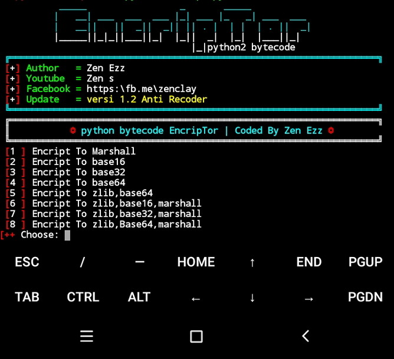

## Installing

```
$ pkg install git
$ pkg install python2
$ pip2 install mechanize
$ git clone https://github.com/Zen-Clay/python-Encript.git
$ cd python-Encript
$ python2 Encript.py
```

## In Tools


## Ask Me On
* [YouTube](https://www.youtube.com/channel/UCopf7XF5D5hVyx2TePHl-pw)
* [Facebook](https://www.facebook.com/fatahul.ulum.1)
* [Instagram](https://www.instagram.com/aditiastrom)
